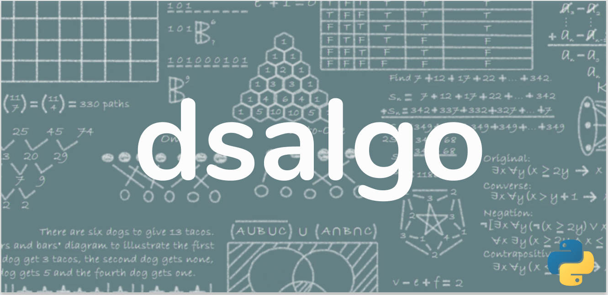

**OBJECTIVE:** 

to develop a library to implement and cover different data structures and algorithms in python to reduce the dependency of coding these datastructures for usage.

**AIM:** 

to cover different available data structures and algorithms for generic cases.

----------------------------------

**CURRENT FEATURES**
====================

* linked list
* sorting algorithms

----------------------------------

**CONTENTS:**
=============

* `setting up`_
* `contribution`_
* `contribution guidelines`_
* `submission template`_

-----------------------------------

**SETTING UP**
=================

FOR LOCAL:
----------

currently dsalgo doesn't support local mode.

FOR DEVELOPMENT:
----------------

setting up for development is easy. use commands below.

Pip Manager:
------------

.. code-block::

      pip install -e dsalgo

Github:
--------

.. code-block::

    pip install git+https://github.com/codesankalp/dsalgo.git

-----------------------------

**CONTRIBUTION**
=====================
anyone can contribute to dsalgo package following these `contribution guidelines`_

**CONTRIBUTION GUIDELINES**
==============================
* appropriate title and details should be present while making pull request. follow `submission template`_.

---------------------------

**CODE OF CONDUCT**
====================
* any available issue that is not assigned to someone is subject to be assigned on first come first serve basis. if the assigned person remains inactive for 72 hours issue will be reassigned to someone else.
* PR is subject to mark invalid in case it is found inappropriate. (don't try to spam)

--------------------------

**SUBMISSION TEMPLATE**
========================
* Title[related to your work]
* Fixes[issue if any]
* Closes[issue if any]
* Details[about your work]
* Test[describe your testing procedure]

